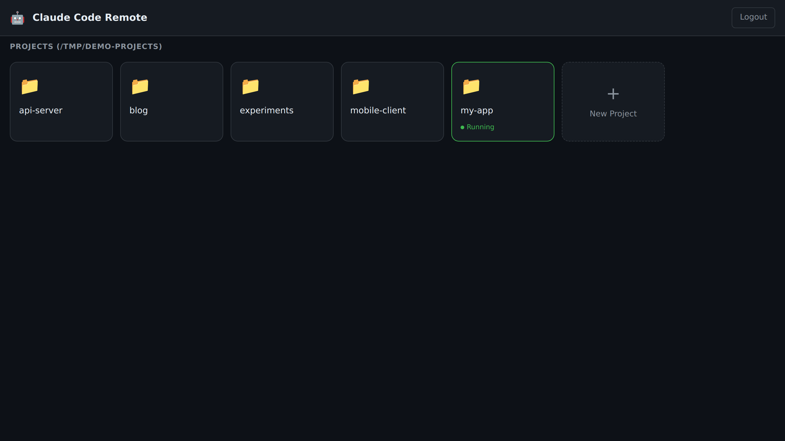

<div align="center">

[English](README.md) | **日本語**

# 🤖 Claude Code Remote

**[Claude Code](https://github.com/anthropics/claude-code) のための、ミニマルでセルフホスト可能なウェブ UI。ブラウザ・スマホ・どこからでも Claude を動かす。**

[](https://github.com/KoichiIshiguro/claude-code-remote/actions/workflows/ci.yml)
[](https://nodejs.org/)
[](LICENSE)
[](#)
[](#)


</div>

> **なぜ作ったか？** 他の Claude Code 用ウェブ UI は 3〜5 万行の React/Tauri 重量級ばかり。これは **Vanilla JS + Express の約 2,000 行** — 半日で読み切れて、週末でフォーク改造できて、実機 iOS Safari で実戦投入済み。

---

## ✨ 機能

- 🔐 **GitHub OAuth** — 単一ユーザーロック、漏洩するパスワードなし
- 💬 **ストリーミング・チャット UI** — ツール使用カード、思考ブロック、ターン毎コスト表示
- 📁 **マルチプロジェクト切替** — `BASE_DIR` 配下の任意サブディレクトリを開ける
- 🧵 **プロジェクト毎にマルチセッション** — 同じリポジトリで並列の会話を保持し、サイドバーから切り替え可能
- 🔄 **任意セッション再開** — Claude 標準の `--resume` 経由
- 🛟 **クラッシュ耐性** — 応答中のストリームをディスクに永続化、再接続で続きから表示
- 🖼️ **画像のドラッグ / 貼り付け** — Claude のプロンプト内パス方式（独自添付 API なし）
- 📱 **インストール可能な PWA** — ステータスバーのスタイリング、スプラッシュ、ホーム画面アイコン
- 🔌 **WebSocket 自動再接続** — モバイル回線切替や PM2 reload を耐える
- 📄 **ブラウザ内ファイルビューワ** — Markdown レンダリング & 更新ボタン
- ⚡ **ステートレスなプロンプトモデル** — プロンプト毎に `claude` を spawn、面倒を見るゾンビなし
- 📊 **コンテキストサイズ表示** — ヘッダの pill と入力エリア上のメータで、直前 API コール時点の input トークン数を表示（TUI と同じ指標）
- 🗜️ **TUI と同じ閾値で auto-compact** — 167k に達したら（Claude Code TUI の 200k context モデル ~83.5% トリガー相当）、次のプロンプト送信前に `/compact` を自動実行

## 📸 スクリーンショット

<table>
  <tr>
    <td align="center"><strong>プロジェクト一覧</strong><br></td>
    <td align="center"><strong>チャット</strong><br></td>
  </tr>
  <tr>
    <td align="center"><strong>サインイン</strong><br></td>
    <td align="center"><strong>モバイル (PWA)</strong><br></td>
  </tr>
</table>

---

## 🚀 クイックスタート — セットアップは Claude に任せる

`claude` は既にインストール済み・ログイン済みでしょう？ コマンドを手打ちする時代は終わりです。

```bash
git clone https://github.com/KoichiIshiguro/claude-code-remote.git
cd claude-code-remote
claude "Read setup.md and set this up. Stop and ask whenever you need input."
```

これだけ。Claude が以下をやってくれます：

1. Node / npm (または pnpm) / `claude` の存在確認
2. `pnpm install`（または `npm install`）
3. github.com 上での OAuth App 作成を対話的にガイド
4. `SESSION_SECRET` を生成
5. レビュー済みの `.env` を書き込み
6. スモークテスト後、オプションで PM2 / systemd / Apache + Let's Encrypt を構成

途中で中断されても、同じコマンドを再実行すれば OK — `setup.md` は **冪等・再開可能** に書かれています。

> はい、この README はあなたがセットアップしようとしているツール本体です。私たちは毎日これを使っています。

<details>
<summary><strong>手動セットアップ派の方はこちら</strong>（クリックで展開）</summary>

### 1. クローン & インストール

```bash
git clone https://github.com/KoichiIshiguro/claude-code-remote.git
cd claude-code-remote
pnpm install   # または npm install / yarn でも OK
```

> リポジトリには `pnpm-lock.yaml` のみコミット。`npm` / `yarn` でも `package.json`
> から解決して動作しますが、厳密なバージョン固定は失われます。

### 2. Claude CLI のインストール

このサーバーは実際の `claude` バイナリを spawn します。先にインストール・ログインしてください：

```bash
# https://docs.claude.com/en/docs/claude-code/quickstart
claude --version
claude auth
```

### 3. GitHub OAuth App の作成

[github.com/settings/developers](https://github.com/settings/developers) → **New OAuth App**

- **Homepage URL**: `https://your-domain.example`
- **Authorization callback URL**: `https://your-domain.example/auth/github/callback`

### 4. `.env` 設定

```bash
cp .env.example .env
```

```env
GITHUB_CLIENT_ID=...
GITHUB_CLIENT_SECRET=...
GITHUB_CALLBACK_URL=https://your-domain.example/auth/github/callback
SESSION_SECRET=$(openssl rand -hex 32)
ALLOWED_GITHUB_USER=your-github-username
PORT=4000
BASE_DIR=/home/you/projects
CLAUDE_PATH=/home/you/.local/bin/claude
```

### 5. 起動

```bash
pnpm start   # または npm start
# 本番運用：
pm2 start server.js --name claude-code-remote && pm2 save
```

`http://localhost:4000` を開いてください。

### 6. （推奨）Apache + Let's Encrypt で HTTPS 化

```apache
<VirtualHost *:443>
    ServerName claude.example.com
    ProxyPreserveHost On

    # WebSocket アップグレード — ProxyPass の前に置くこと
    RewriteEngine On
    RewriteCond %{HTTP:Upgrade} websocket [NC]
    RewriteCond %{HTTP:Connection} upgrade [NC]
    RewriteRule /(.*) ws://127.0.0.1:4000/$1 [P,L]

    ProxyPass / http://127.0.0.1:4000/
    ProxyPassReverse / http://127.0.0.1:4000/
    LimitRequestBody 26214400    # 画像アップロード用 25 MB

    SSLCertificateFile /etc/letsencrypt/live/claude.example.com/fullchain.pem
    SSLCertificateKeyFile /etc/letsencrypt/live/claude.example.com/privkey.pem
</VirtualHost>
```

その後 `sudo certbot --apache -d claude.example.com`。

</details>

---

## 🆚 比較

| | **Claude Code Remote** | [siteboon/claudecodeui](https://github.com/siteboon/claudecodeui) | [d-kimuson/claude-code-viewer](https://github.com/d-kimuson/claude-code-viewer) |
|---|---|---|---|
| 行数 | **約 2,000** | 5 万行以上 | 3 万行以上 |
| 認証 | **GitHub OAuth** | なし / トークン | パスワード単一 |
| フロントエンド | Vanilla JS（ビルド不要） | React + Vite | React + Vite |
| 応答中の状態永続化 | **✅** | ❌ | ❌ |
| 画像貼り付け | ✅ | ❓ | ✅ |
| PWA | ✅ | ❓ | ✅ |
| WebSocket 自動再接続 | ✅ | ❓ | ❓ |
| マルチプロジェクト切替 | ✅ | ✅ | ✅ |
| 1プロジェクト複数セッション | ✅ | ❓ | ✅ |
| 認証差し替え | リバプロで | 同左 | 同左 |
| 全コード読了時間 | **約 1 時間** | 1 週間 | 数日 |

**結論：** CodeMirror エディタや Git GUI が欲しいなら CloudCLI。動くだけのチャット UI を週末で改造したいならこれ。

---

## 🏗️ 仕組み

```
┌─────────────────┐   HTTPS    ┌──────────────────┐
│ Browser / PWA   │ ◄────────► │ リバースプロキシ │
│ (iOS / Desktop) │            │ (Apache / Caddy) │
└─────────────────┘            └────────┬─────────┘
                                        │ HTTP + WS
                                        ▼
                               ┌──────────────────┐
                               │ Node.js サーバー │
                               │ （本リポ）       │
                               │ • Express        │
                               │ • ws             │
                               │ • passport       │
                               └────────┬─────────┘
                                        │ プロンプト毎に spawn()
                                        ▼
                               ┌──────────────────┐
                               │ claude CLI       │
                               │ -p --resume <id> │
                               │ --output-format  │
                               │   stream-json    │
                               └──────────────────┘
```

**設計上の重要選択**

- **プロンプト毎に `claude` を 1 プロセス。** 常駐エージェントなし。会話履歴は Claude 本体の `~/.claude/projects/*.jsonl` にあり、`--resume` で復元。
- **応答中の状態を 500 ms ごと（debounce）にディスク書き出し。** サーバーが応答中に殺されても、再接続で途中までを描画 → 「続けて」と書けば Claude が `--resume` で再開。
- **画像はプロンプト本文にファイルパスを埋め込み。** Claude Code TUI のドラッグ&ドロップと同じ仕様。
- **ビルド工程なし。** フロントは `<script>` + Vanilla JS + `marked` 1 つだけ。不安定なモバイル回線越しでも `npm install` で動く。
- **コンテキスト追跡は per-call `usage` から。** 各 `assistant` ストリームイベントが持つその API コール固有の input トークン数を使用（ターン累計ではない）。メータと auto-compact 判定の両方がこの値を読むので、Claude Code TUI 本体の `/compact` 閾値と同じ挙動になる。

---

## 🔧 環境変数リファレンス

| 変数 | 必須 | 説明 |
|---|---|---|
| `GITHUB_CLIENT_ID` | ✅ | GitHub OAuth App から |
| `GITHUB_CLIENT_SECRET` | ✅ | GitHub OAuth App から |
| `GITHUB_CALLBACK_URL` | ✅ | OAuth App の設定と完全一致させること |
| `SESSION_SECRET` | ✅ | 長いランダム文字列（`openssl rand -hex 32`） |
| `ALLOWED_GITHUB_USER` | | この GitHub ユーザー名のみログイン可。未設定だと誰でもログイン可 — **非推奨** |
| `PORT` | | デフォルト `4000` |
| `BASE_DIR` | | プロジェクトピッカーの起点（例 `/home/you/projects`） |
| `CLAUDE_PATH` | | `claude` の絶対パス — PM2 / systemd 配下では必須 |
| `CLAUDE_AUTO_COMPACT_THRESHOLD` | | 次プロンプト送信前に自動 `/compact` を発火する input トークン閾値。デフォルト `167000`（TUI の 200k context モデル ~83.5% トリガー相当）。1M context tier 利用時は `835000` 等に上げる |
| `NODE_ENV` | | `production` に設定すると HTTPS-only クッキーになる |

---

## 🛡️ セキュリティ注意

- **単一ユーザー前提の設計。** `ALLOWED_GITHUB_USER` を毎ログイン検証。マルチユーザーモードも管理画面もない — これが全セキュリティモデル。
- **本番では HTTPS 必須。** そうでないと OAuth トークンとセッションクッキーが平文で飛ぶ。
- **`--dangerously-skip-permissions` がデフォルト ON。** これは自分用リモートだから。公開するなら、Claude にファイルシステムを預ける覚悟で `BASE_DIR` を安全なサブツリーに制限すること。
- **セッションストアはメモリ。** PM2 reload でログアウトされます。気になるなら `connect-sqlite3` か `connect-redis` に差し替え（`src/auth.js` 1 行）。

---

## 🗺️ ロードマップ

- [ ] 永続セッションストア（SQLite）で PM2 reload でログアウトしない
- [ ] Docker イメージ
- [ ] ファイルビューワでの CodeMirror ライブ編集
- [ ] 長時間プロンプト完了時のプッシュ通知
- [ ] OAuth グループによるマルチユーザー（恐らくやらない — 設計思想と合わない）

PR 歓迎（最後の項目は反論も歓迎）。

---

## 🤝 コントリビュート

これは個人ツールが共有可能なものに育ったプロジェクトです。**行数を抑え、依存を増やさない PR** を歓迎します。5 MB のチャートライブラリを追加したい方は先に issue を開いてください。

```bash
git clone https://github.com/KoichiIshiguro/claude-code-remote.git
cd claude-code-remote
pnpm install          # または npm install
cp .env.example .env  # 秘密情報を埋める
pnpm dev              # ファイル変更で自動再起動
```

---

## 📜 ライセンス

MIT — [LICENSE](LICENSE) を参照。

`claude` 自体は Anthropic の商用製品で、本リポには同梱されていません。各自で Claude アカウント / API アクセスを用意してください。

---

<div align="center">

**GitHub 上のリモート Claude UI が、肥大化してるか放置されてるかのどちらかだったので作りました。**

週末を救えたなら、⭐ をぜひ — このプロジェクトが求める唯一の報酬です。

</div>
