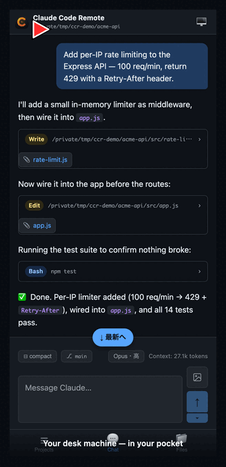
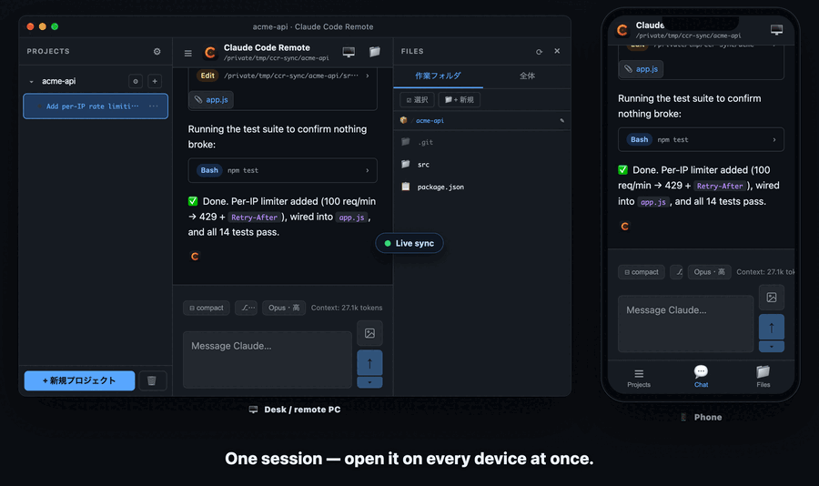
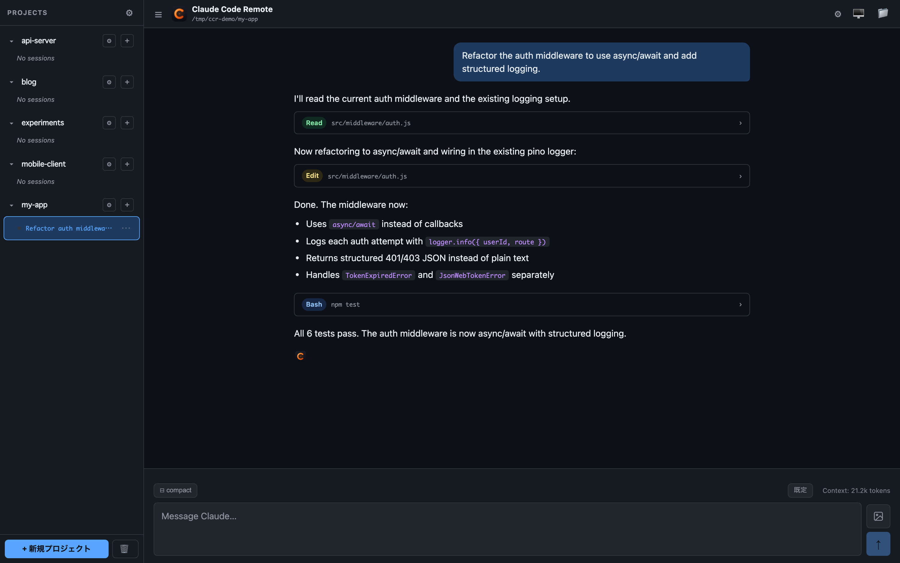
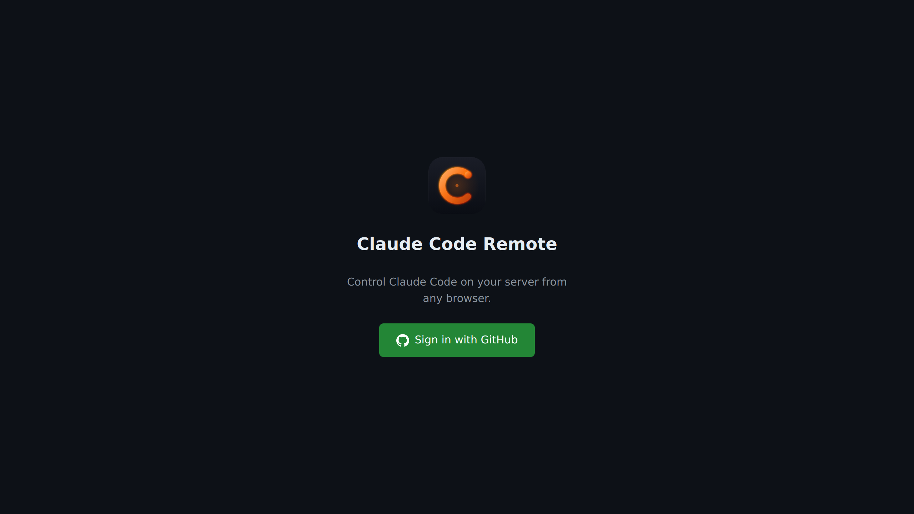
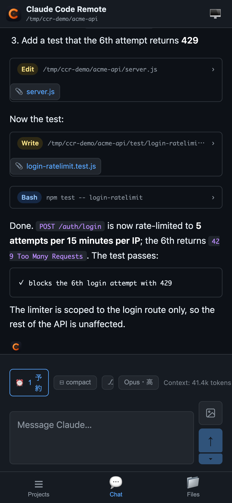
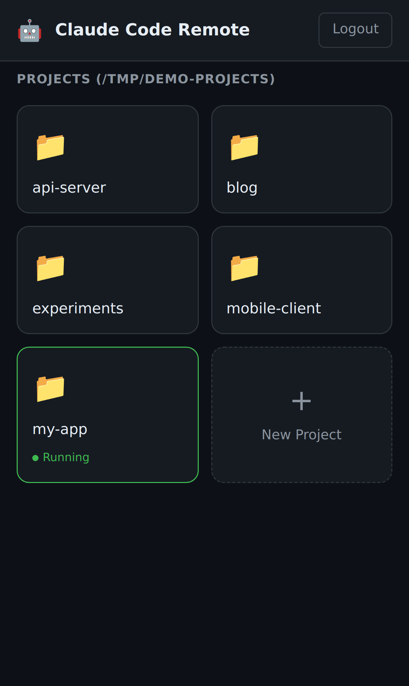

<div align="center">

[English](README.md) | **日本語**

# 🤖 Claude Code Remote

**いつものメインPCのAIを、どの端末からでも操作する。** [Claude Code](https://github.com/anthropics/claude-code) のためのミニマルでセルフホスト可能なウェブ UI — エージェントは自分のマシン上で 1 つだけ動き、スマホ・別PC・どこからでも同じものを操作。ファイルもコンテキストも進捗も、すべて 1 か所に集約。

[](https://github.com/KoichiIshiguro/claude-code-remote/actions/workflows/ci.yml)
[](https://nodejs.org/)
[](LICENSE)
[](#)
[](#)



<sub>実セッションを作業の途中からスマホで。制限解除後に続きを発火する予約、モデル/工数のインライン切替まで。</sub>

</div>

## 💡 これは何のツールか — 「いつものPC」を、どこからでも

これは「ブラウザのタブで動く Claude」ではありません。**普段あなたが作業しているそのPCを、スマホ・ノート・別のマシンから操作できる“常時稼働のワークステーション”に変える**ツールです。ファイルもセッションもコンテキストも、端末間でコピーして持ち歩く必要はありません。

エージェントは **1 台のマシン（あなたのPC）でだけ** 動き、各端末はそこを覗く“窓”にすぎない。このたった 1 つの設計が、下の 3 つを成立させています。

**1. 本物の Claude を、あなたのサブスクで。API キー課金ではない。**
本物の `claude` CLI を `-p`（ヘッドレス）モードで動かすので、**いま契約している Pro / Max プランのまま**動きます。TUI と同じログイン・同じ利用枠。別途の API 課金も、トークン単価の不意打ちもありません。
*例：外出先でスマホしかない。机の上で途中まで進めていたのと同じ Claude を開くと、プランにログインしたまま続きが触れる。再認証も API キーの貼り付けも不要。*

**2. 制限が来た？ なら「解除された瞬間」に予約しておく。**
Claude が *「session limit · resets 2:50am」* を返すと、アプリがそのリセット時刻を読み取ります。次のプロンプトを入力し、送信ボタンの **`▾`** をタップすると、検知した時刻が入った **「制限解除後に送信」** プリセットがすぐ選べる状態で待っています。予約は **サーバー側で、解除の少し後（2:50am の +約10分の安全マージン）に発火** — あなたが起きている必要も、ブラウザを開いておく必要もなく、回復した枠を遊ばせません。
*例：深夜 2 時、寝る前に「テストを回して赤いところを直して」を予約。起きた頃には、枠が開いてから自動で走り終えている。（予約は `▾` を選ぶ明示的なワンタップ操作です。通常の送信はこれまで通り即送信なので、知らないうちに先送りされることはありません。）*

**3. コンテキストも進捗も 1 つ。全デバイスで共有。**
エージェントが 1 台に 1 つだから、**履歴・コンテキスト・実行中の進捗がどの端末でも同じ**です。デスクトップで始めた作業を電車でスマホから確認し、カフェのノートで仕上げる — それは文字通り「同じセッションの続き」、考えている途中そのまま。
*対比：複数マシンを共有ドライブに向けても、共有されるのはファイルだけで Claude の履歴は付いてきません（各マシンが自分の `~/.claude` を持つため）。このツールでは「そもそも 1 台から出ていない」から、コンテキストがあなたに付いてくる。*

<div align="center">

<br><sub>1 つのセッションを 2 台で同時に。スマホから送信すると、その瞬間にデスクPCでもストリームされる — 同じエージェント、同じコンテキスト（リロードではなく WebSocket の実ブロードキャスト）。</sub>
</div>

---

> **なぜこんなに小さいのか？** 他の Claude Code 用ウェブ UI は 3〜5 万行の React/Tauri 重量級ばかり。これは **Vanilla JS + Express のバックエンド約 3,000 行** — 半日で読み切れて、週末でフォーク改造できて、実機 iOS Safari で実戦投入済み。

---

## ✨ 機能

- 🔐 **Tailscale 前提の認証** — 初回起動時にブラウザで ID/PW を設定。公開ネットではなく**自分の Tailscale ネットワーク内**で運用する設計
- 💬 **ストリーミング・チャット UI** — ツール使用カード、思考ブロック、ターン毎コスト表示
- 📁 **明示的なマルチプロジェクト切替** — 内蔵のファイルブラウザ（または zip インポート）で任意フォルダを登録。各プロジェクトは自分のパス内にサンドボックスされ、追加してもセッションは自動生成されない
- 🧵 **プロジェクト毎にマルチセッション** — 同じリポジトリで並列の会話を保持し、サイドバーから切り替え可能
- 🗄️ **セッションのアーカイブ / 復元 / 完全削除** — 終わったスレッドを隠す・戻す・元の jsonl ごと削除
- ↔️ **TUI と相互互換** — Claude 本体の `~/.claude/projects/*.jsonl` を唯一の正とするため、`claude` CLI で始めたセッションがここに出る（逆も同様）
- 🔄 **任意セッション再開** — Claude 標準の `--resume` 経由
- 🖥️ **内蔵ターミナル** — セッション毎に tmux ベースの永続シェル（tmux がある環境ではサーバー再起動も生き残る）。Windows / tmux 無し環境ではプレーンシェルにフォールバック
- 🛟 **クラッシュ耐性** — 応答中のストリームをディスクに永続化、再接続で続きから表示
- 🖼️ **画像のドラッグ / 貼り付け** — Claude のプロンプト内パス方式（独自添付 API なし）
- 📱 **インストール可能な PWA** — ステータスバーのスタイリング、スプラッシュ、ホーム画面アイコン
- 🔌 **WebSocket 自動再接続** — モバイル回線切替や PM2 reload を耐える
- 📄 **ブラウザ内ファイルビューワ** — Markdown レンダリング & 更新ボタン
- ⚡ **ステートレスなプロンプトモデル** — プロンプト毎に `claude` を spawn、面倒を見るゾンビなし
- 📊 **コンテキストサイズ表示** — 入力エリア上のメータで、直前 API コール時点の input トークン数を表示（TUI と同じ指標）
- 🗜️ **TUI と同じ閾値で auto-compact** — 167k に達したら（Claude Code TUI の 200k context モデル ~83.5% トリガー相当）、次のプロンプト送信前に `/compact` を自動実行。compact 後は Claude の `compact_boundary` メタデータから圧縮後トークン数を読み戻すので、手動 `/compact` 直後に再び auto-compact へ当選しない
- ⏰ **予約送信（send-later）** — Gmail 風の分割送信ボタン。本体はこれまで通り即送信、`▾` でプロンプトを指定時刻に予約。予約は**サーバー側**で発火するのでブラウザを閉じても・再起動しても実行される。`session limit · resets …` を検知すると `▾` メニューに **「制限解除後に送信」** プリセットが出る（検知時刻＋約10分の安全マージン入り）ので、ワンタップで予約しておけば、枠が開いた後に続きが自動で発火する
- 🎚️ **モデル / 工数のインライン切替** — ステータスバーのピルをタップするとプルアップが開き、設定モーダルを開かずにモデル（Opus / Sonnet / Haiku / Fable、または任意のモデル名）と工数（effort）を即切替
- ⌨️ **スラッシュコマンド補完** — `/` を入力すると、その `-p` 環境が実際に公開しているコマンド（スキル＋ `/compact` 等の組み込み）から選択
- 🖼️ **成果物のインライン表示** — Claude が書き出したファイル（`Write`/`Edit`、または `Bash` 内の画像パス）やスクリーンショットを、スレッド内にプレビュー／ダウンロードリンクとして表示

## 📸 スクリーンショット

<table>
  <tr>
    <td align="center" width="50%"><strong>チャット</strong><br></td>
    <td align="center" width="50%"><strong>サインイン</strong><br></td>
  </tr>
  <tr>
    <td align="center"><strong>モバイル (チャット)</strong><br></td>
    <td align="center"><strong>モバイル (プロジェクト)</strong><br></td>
  </tr>
</table>

---

## 🚀 クイックスタート

### 1. 前提ソフト

- **Node.js ≥ 18**、**git**、**[Claude CLI](https://docs.claude.com/en/docs/claude-code/quickstart)**（Pro / Max でログイン済み）
- （推奨）**[Tailscale](https://tailscale.com/download)** — スマホから自宅 PC に届くため

### 2. クローン & インストール

```bash
git clone https://github.com/KoichiIshiguro/claude-code-remote.git
cd claude-code-remote
npm install
```

### 3. 起動

```bash
npm start
```

`http://localhost:4000` を開く → `/setup` に自動リダイレクトされる初回ウィザードでユーザー名・パスワード・アクセススコープ（サンドボックスする単一フォルダ、または信頼できる tailnet 上でのフルアクセス）を設定すれば完了。

セットアップ後、スマホからは `http://<Tailscale-IP>:4000` でアクセス（ウィザード画面に URL と QR コードが表示されます）。

### ユーザー名・パスワードを忘れた時

リカバリーメールも「パスワードを忘れた」リンクも意図的にありません（単一ユーザ・個人用前提）。リセットするには:

```bash
node server.js --reset-auth
```

`data/admin.json` を削除して終了します。次回の `npm start` で `/setup` にリダイレクトされ、新しいユーザー名・パスワードを再設定できます。`config.json`、プロジェクト一覧、会話履歴 (jsonl) はそのまま残ります。

### （任意）起動時に自動実行

PC の電源 ON で自動起動させたい場合は、launchd（macOS）、systemd（Linux）、Windows タスクスケジューラなどでこのディレクトリの `node server.js` を指定して登録してください。

> **⚠️ バックグラウンド常駐には長期トークンが必要。** `claude` を対話的に実行すると OAuth 認証情報をログイン Keychain から読みますが、launchd/systemd の常駐エージェントは GUI ログインセッションの *外* で動くため **Keychain を読めず**、古いトークンにフォールバックして毎プロンプトが `401 Invalid authentication credentials` で失敗します。一度だけ直せば OK：普段使いの GUI マシンで実際のターミナルを開き
> ```bash
> claude setup-token        # 認可のためブラウザが開く（TTY が必要）
> ```
> を実行し、表示されたトークンをこのディレクトリの `.env` に入れてサービスを再起動：
> ```bash
> echo 'CLAUDE_CODE_OAUTH_TOKEN=sk-ant-oat01-...' >> .env
> ```
> サーバーは spawn する各 `claude` にこれをそのまま渡すので、認証が Keychain に依存しなくなります。（自分のシェルで手動 `node server.js` する場合は不要 — そのシェルは既に Keychain にアクセスできます。）

### （任意）公開 HTTPS 化

Tailscale ではなくインターネット公開したい場合は **やめておく**のが安全ですが、どうしても必要なら：リバプロ（Apache / Caddy / nginx）で TLS 終端 → リバプロ側で HTTP basic-auth を本サーバの ID/PW の前段に追加 → アクセススコープをサンドボックス的なサブツリーに限定。

---

## 🆚 比較

| | **Claude Code Remote** | [siteboon/claudecodeui](https://github.com/siteboon/claudecodeui) | [d-kimuson/claude-code-viewer](https://github.com/d-kimuson/claude-code-viewer) |
|---|---|---|---|
| 行数 | **約 3,000** | 5 万行以上 | 3 万行以上 |
| 認証 | **ローカル ID/PW + Tailscale** | なし / トークン | パスワード単一 |
| フロントエンド | Vanilla JS（ビルド不要） | React + Vite | React + Vite |
| 応答中の状態永続化 | **✅** | ❌ | ❌ |
| 画像貼り付け | ✅ | ❓ | ✅ |
| PWA | ✅ | ❓ | ✅ |
| WebSocket 自動再接続 | ✅ | ❓ | ❓ |
| マルチプロジェクト切替 | ✅ | ✅ | ✅ |
| 1プロジェクト複数セッション | ✅ | ❓ | ✅ |
| 認証差し替え | リバプロで | 同左 | 同左 |
| 全コード読了時間 | **約 1 時間** | 1 週間 | 数日 |

**結論：** CodeMirror エディタや Git GUI が欲しいなら CloudCLI。動くだけのチャット UI を週末で改造したいならこれ。

---

## 🏗️ 仕組み

```
┌─────────────────┐   HTTPS    ┌──────────────────┐
│ Browser / PWA   │ ◄────────► │ リバースプロキシ │
│ (iOS / Desktop) │            │ (Apache / Caddy) │
└─────────────────┘            └────────┬─────────┘
                                        │ HTTP + WS
                                        ▼
                               ┌──────────────────┐
                               │ Node.js サーバー │
                               │ （本リポ）       │
                               │ • Express        │
                               │ • ws             │
                               │ • bcrypt session │
                               └────────┬─────────┘
                                        │ プロンプト毎に spawn()
                                        ▼
                               ┌──────────────────┐
                               │ claude CLI       │
                               │ -p --resume <id> │
                               │ --output-format  │
                               │   stream-json    │
                               └──────────────────┘
```

**設計上の重要選択**

- **プロンプト毎に `claude` を 1 プロセス。** 常駐エージェントなし。会話履歴は Claude 本体の `~/.claude/projects/*.jsonl` にあり、`--resume` で復元。
- **応答中の状態を 500 ms ごと（debounce）にディスク書き出し。** サーバーが応答中に殺されても、再接続で途中までを描画 → 「続けて」と書けば Claude が `--resume` で再開。
- **画像はプロンプト本文にファイルパスを埋め込み。** Claude Code TUI のドラッグ&ドロップと同じ仕様。
- **ビルド工程なし。** フロントは `<script>` + Vanilla JS + `marked` 1 つだけ。不安定なモバイル回線越しでも `npm install` で動く。
- **コンテキスト追跡は per-call `usage` から。** 各 `assistant` ストリームイベントが持つその API コール固有の input トークン数を使用（ターン累計ではない）。メータと auto-compact 判定の両方がこの値を読むので、Claude Code TUI 本体の `/compact` 閾値と同じ挙動になる。
- **プロンプトキューはブラウザではなくサーバー側。** 応答ストリーム中に送ったプロンプトはセッション毎のキューに溜まり、ランナーがブラウザ非依存で順次消化する（タブを閉じても実行される）。ライブキューはメモリ上（再起動でクリア＝仕様）。**予約送信**はその永続版で、`data/scheduled-prompts.json` に保存し、30 秒間隔のサーバータイマーが期限到来時に同じキューへ投入する。

---

## 🔧 環境変数リファレンス

設定は基本 **すべて任意** です — 初回ウィザード `/setup` が `data/admin.json` と `data/config.json` に認証情報・アクセススコープを書き込み、登録済みプロジェクトは `data/projects.json`、`SESSION_SECRET` は自動生成されます。env 変数は **デフォルトを上書きしたいときだけ** 使ってください（アクセススコープとプロジェクト一覧は env ではなく UI で管理します）。

| 変数 | 説明 |
|---|---|
| `PORT` | HTTP ポート。デフォルト `4000` |
| `CLAUDE_PATH` | `claude` の絶対パス — PATH が継承されない環境（PM2 / systemd / launchd）で必要 |
| `CLAUDE_CODE_OAUTH_TOKEN` | `claude setup-token` で得る長期認証トークン。**launchd/systemd 配下では必須**（ログイン Keychain を読めず、無いと毎プロンプト 401）。下記「起動時に自動実行」参照 |
| `SESSION_SECRET` | 自動生成された値を上書き（複数デプロイで Cookie ドメインを共有したい場合などに） |
| `CLAUDE_AUTO_COMPACT_THRESHOLD` | 次プロンプト送信前に自動 `/compact` を発火する input トークン閾値。デフォルト `167000`（TUI の 200k context モデル ~83.5% トリガー相当）。1M context tier 利用時は `835000` 等 |
| `TMUX_PATH` | 内蔵ターミナル用の `tmux` 絶対パス — PATH に無いとき設定。未設定なら `which tmux` で自動検出し、tmux が無ければプレーンシェルにフォールバック |
| `CCR_SHELL` | 内蔵ターミナルが起動するシェルの上書き（デフォルト `$SHELL -l`、Windows は `powershell.exe`） |
| `NODE_ENV=production` | HTTPS-only Cookie を強制。前段で TLS 終端しているときだけ設定 |
| `CLAUDE_SANDBOX` | **macOS のみ。** `0` でセッション毎の OS サンドボックスを無効化。デフォルト ON — セキュリティ注意参照 |

---

## 🛡️ セキュリティ注意

- **Tailscale 上での運用を前提に設計。** `/setup` で設定する bcrypt ハッシュ済みパスワード 1 本（`data/admin.json` 保存）では、公開ネットからのブルートフォースを長期的に防げません。**自分の tailnet 内**に置く、もしくはどうしても公開する場合はリバプロ側で HTTP basic-auth を本サーバの ID/PW の前段に重ねてください。
- **Tailscale 外への公開時は HTTPS 必須。** セッションクッキー平文は即終了です。
- **`--dangerously-skip-permissions` がデフォルト ON。** これは自分用リモートだから。公開するなら、Claude にファイルシステムを預ける覚悟でアクセススコープを安全なサブツリーに限定。
- **セッション毎の OS サンドボックス（macOS）。** `--dangerously-skip-permissions` 下でも、spawn された各 `claude` は `sandbox-exec`（カーネルレベルの Seatbelt）でラップされ、**自分のセッションフォルダ（＋ `~/.claude`・temp）の外には一切書き込めず**、**兄弟プロジェクトの読み取りやセッションフォルダより上への遡上もできません** — syscall 単位の強制なので `bash`/`cat` 経由でも有効。Node サーバー本体はサンドボックスされません（ピッカー・ファイルビューワ等でフルアクセスが必要）。macOS 限定、`CLAUDE_SANDBOX=0` で無効化。Linux/Windows では未対応。
- **単一ユーザー前提の設計。** マルチユーザーモードも管理画面もない — これが全セキュリティモデル。
- **セッションストアはファイル永続化。** `data/auth-sessions.json` にアトミック書き込み（`src/session-store.js`）するため、サーバー再起動や PM2 reload でログアウトされません。単一 JSON ファイルで足りなくなったら `connect-sqlite3` / `connect-redis` に差し替え可能。

---

## 🗺️ ロードマップ

- [x] 永続セッションストアで再起動 / PM2 reload でログアウトしない
- [ ] Docker イメージ
- [ ] ファイルビューワでの CodeMirror ライブ編集
- [ ] 長時間プロンプト完了時のプッシュ通知
- [ ] OAuth グループによるマルチユーザー（恐らくやらない — 設計思想と合わない）

ロードマップは [issues](https://github.com/KoichiIshiguro/claude-code-remote/issues) で管理しています。バグ報告・機能要望は issue でどうぞ。

---

## 🤝 コントリビュート

**Pull Request は受け付けていません。** 本プロジェクトは単独著者のコードベースとして維持されています。バグ報告・機能要望は issue でお願いします — 読みますし対応も検討しますが、外部からのマージは受けていません。

自分用にローカル開発環境を立てたい場合は以下:

```bash
git clone https://github.com/KoichiIshiguro/claude-code-remote.git
cd claude-code-remote
pnpm install          # または npm install
cp .env.example .env  # 秘密情報を埋める
pnpm dev              # ファイル変更で自動再起動
```

---

## 📜 ライセンス

**[PolyForm Internal Use 1.0.0](LICENSE)** — 内部利用に限り公開されたソースアベイラブル・ライセンス。

許可されること:
- 自分の内部業務利用（個人・社内）目的での clone、ビルド、実行、改変
- 自分が管理するインフラ上でのセルフホスト

禁止されていること:
- 改変版・未改変版を問わず、第三者への配布（無償・有償を問わず）
- 第三者向けのホスティング / マネージドサービスとしての提供
- 本リポジトリのフォークの再公開

> **v0.6.0 以前のバージョンは MIT License のまま利用可能です。** ライセンス変更は v0.6.0 リリース直後のコミットから適用されます。

`claude` 自体は Anthropic の商用製品で、本リポには同梱されていません。各自で Claude アカウント / API アクセスを用意してください。

---

<div align="center">

**GitHub 上のリモート Claude UI が、肥大化してるか放置されてるかのどちらかだったので作りました。**

週末を救えたなら、⭐ をぜひ — このプロジェクトが求める唯一の報酬です。

</div>
